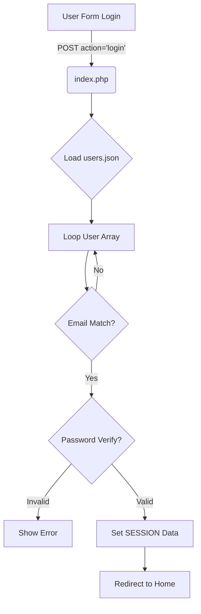
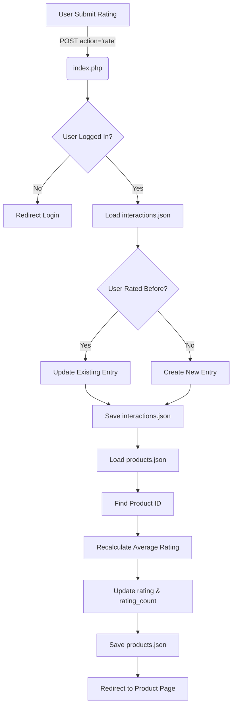

# Dokumentasi Flow: Login & Rating System

Dokumen ini menjelaskan alur teknis (flowchart logic) tentang bagaimana sistem menangani proses **Login User** dan **Submission Rating**, serta bagaimana data tersebut diproses secara real-time ke dalam database JSON (`products.json`, `users.json`, `interactions.json`).

---

## 1. Flow Login User

Proses ini memverifikasi identitas pengguna dan memulai sesi agar sistem dapat mengenali siapa yang sedang aktif.

### Alur Proses (Step-by-Step):

1.  **User Input**: User memasukkan Email & Password di halaman Login (`?page=login`).
2.  **Request POST**: Form mengirim request `POST` dengan `action=login` ke `index.php`.
3.  **Memuat Database**:
    *   Sistem membaca file `data/users.json`.
    *   Mengubah format JSON menjadi Array PHP (`json_decode`).
4.  **Verifikasi Loop**:
    *   Sistem melakukan looping pada array user.
    *   Mencocokkan **Email**.
    *   Jika Email cocok, sistem memverifikasi **Password** menggunakan `password_verify()` (mencocokkan hash).
5.  **Hasil Verifikasi**:
    *   **Jika Cocok**:
        *   Simpan `user_id` dan `user_name` ke dalam `$_SESSION`.
        *   Redirect ke Halaman Utama (`index.php`).
    *   **Jika Gagal**:
        *   Tampilkan pesan error "Invalid email or password".

### Diagram Flow Login

---

## 2. Flow Submission Rating & Real-Time Processing

Proses ini adalah inti dari sistem rekomendasi, di mana interaksi user langsung mengubah data produk dan log interaksi.

### Alur Proses (Step-by-Step):

1.  **User Action**: User yang sudah login mengklik bintang (1-5) dan tombol *Submit* di halaman detail produk.
2.  **Request POST**: Form mengirim request `POST` dengan `action=rate`, `product_id`, dan `rating` ke `index.php`.
3.  **Validasi Sesi**: Sistem mengecek apakah `$_SESSION['user_id']` ada. Jika tidak, redirect ke login.
4.  **Update `interactions.json` (Log History)**:
    *   Sistem membaca `interactions.json`.
    *   **Cek Duplikasi**: Apakah User ini sudah pernah merating Produk ini?
        *   **Ya**: Update rating lama dengan rating baru & update timestamp.
        *   **Tidak**: Buat entry baru array `['user_id', 'product_id', 'rating', 'timestamp']`.
    *   **Simpan**: Tulis kembali array yang sudah diupdate ke `interactions.json` (`file_put_contents`).
5.  **Update `products.json` (Rating Global)**:
    *   Sistem membaca `products.json`.
    *   Mencari produk berdasarkan `product_id`.
    *   **Kalkulasi Ulang (Incremental Update)**:
        *   Hitung rata-rata baru: `((Rata2 Lama * Jumlah Lama) + Rating Baru) / (Jumlah Lama + 1)`.
        *   Update field `rating` dan `rating_count` pada produk tersebut.
    *   **Simpan**: Tulis kembali array produk ke `products.json`.
6.  **Selesai**: Redirect kembali ke halaman produk dengan status sukses.

### Dampak Langsung (Real-Time Effect):
Setelah proses ini selesai dalam hitungan milidetik:
*   **Halaman Home**: Jika user kembali ke Home, algoritma rekomendasi (`getUserPreferences`) akan membaca file `interactions.json` yang **baru saja diupdate**.
*   **Rekomendasi Berubah**: Jika user baru saja memberi rating 5 pada sepatu "Nike", sistem akan langsung mendeteksi preferensi baru terhadap brand "Nike" dan mengubah urutan produk di halaman Home saat itu juga.

### Diagram Flow Rating

